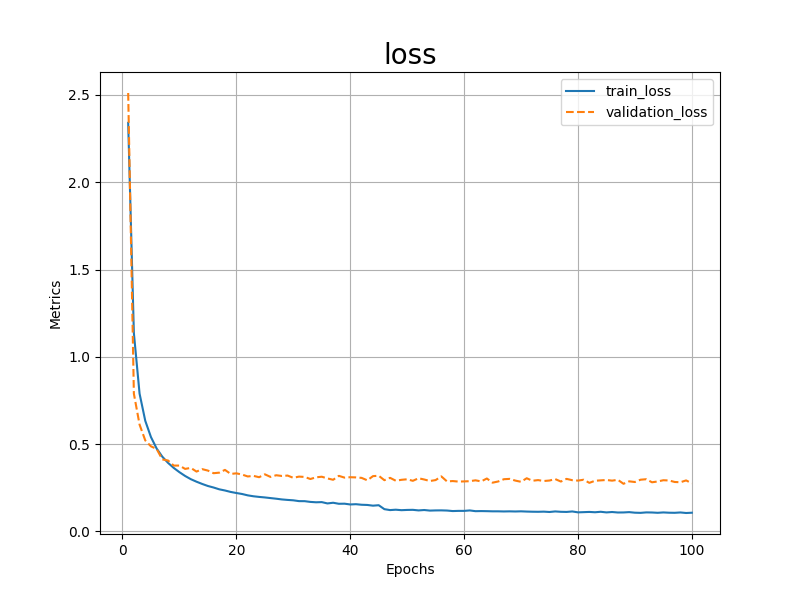
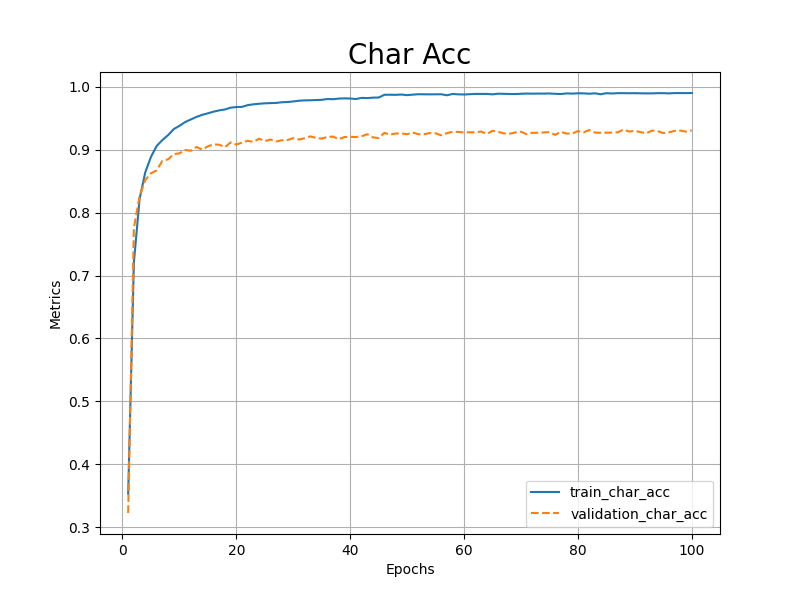
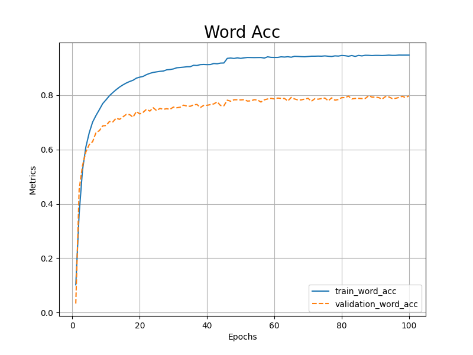

# Writing On Air

This project is a machine learning implementation that enables users to write on air using hand gestures, and convert the handwritten text into digital text using Optical Character Recognition (OCR).

## Demo

Check out  demo video to see Writing On Air in action!

https://github.com/ahmed-saad1997/Writing-On-Air/assets/107448581/a9dc63bb-1977-4333-b61d-4c9d30c800ca

The demo showcases real-time testing and includes an animation to demonstrate how the project works.

## Description

The project consists of two machine learning models. The first model is a hand landmark detection model, which is implemented using the Mediapipe pre-trained model. The second model is an OCR model, which is trained from scratch using Pytorch and a combination of the "IAM Online handwriting dataset" and "synthetic-data".

The OCR model achieved an accuracy of 99% for character accuracy and 95% for word accuracy on the training set, and 93% for character accuracy and 80% for word accuracy on the validation set. The model was trained for 100 epochs.

## Getting Started

To get started, clone this repository to your local machine:

```
git clone https://github.com/ahmed-saad1997/Writing-On-Air.git
```

Then, install the required dependencies:

```
pip install -r requirements.txt
```

## Usage

To run real-time testing on your webcam, navigate to the project directory and execute:

```
python run.py
```

If you want to save the output video, you can add the `--path` option followed by the path where you want to save the video:

```
python run.py --path output.mp4
```

## OCR Training

To train the OCR model from scratch, you can look into the `OCR_training` folder. The OCR system is built using deep learning techniques and trained on a custom dataset of handwritten characters.

## OCR Training Results

Here are some examples of OCR training results:







## Datasets

The datasets used in OCR training include:

- **Synthetic-data:** A synthetic dataset of handwritten characters generated using a script that simulates handwriting. The dataset includes a variety of fonts, styles, and sizes.

- **IAM:** A collection of handwritten text samples collected from forms filled out by writers. The dataset includes a wide range of writing styles and conditions.

## Credits

- The hand landmark detection model was implemented using the Mediapipe pre-trained model.
- The OCR model was trained from scratch using guides from "Modern Computer Vision with PyTorch" (V Kishore Ayyadevara
and Yeshwanth Reddy) Book and a combination of the "IAM handwriting dataset" and "synthetic-data".

## License

This project is licensed under the MIT License - see the `LICENSE` file for details.
